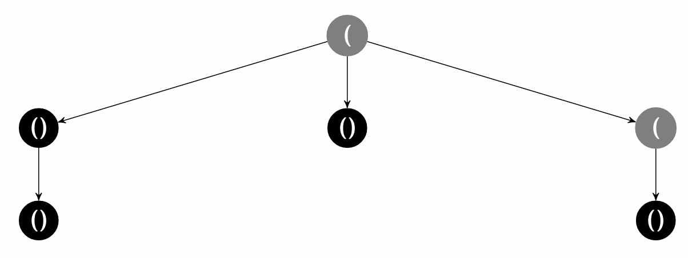

# ISBSRN - I Should Be Studying Right Now

But I needed to write something to parse a file of brackets for syntax highlighting.

There are probably millions of implementations of this, millions of which are better than mine. So be it, because C++ can be fun to write in.

## Usage

`open_node` indicates an opening bracket. It adds a child to the current bracket and recursively starts again.

`closed_node` indicates a closing bracket. It marks the current node as closed, and returns to the parent.

Both return a pointer to a `parse_node` which indicates the current state of the parsing tree.

Code to parse a list of booleans giving open or close:

```cpp
int main () {
    parse_node *current = new parse_node((parse_node *)0);
    
    std::vector<bool> bracks = {1, 0, 1, 0};
    
    for (bool b : bracks) {
        if (b) current = current->open_node();
        else current = current->close_node();
    }
}
```

## Speed

This algorithm is `O(n)`. 

Bracket count | Speed (μs) 
--- | ---
4 | 1.514
8 | 2.17
16 | 3.611
32 | 6.45
64 | 12.295
128 | 24.396
256 | 48.1715
512 | 94.8365
1024 | 188.266
2048 | 375.211
4096 | 749.769
8192 | 1497.3
16384 | 2992.72
32768 | 5970.11

10<sup>3</sup>μs = 1ms, 10<sup>6</sup>μs = 1s


## Example

Parsing `((())()(()`


By hand, we can also get the answer of 

```
(
    (
        (
        )
    )
    (
    )
    (
    	(
        )


